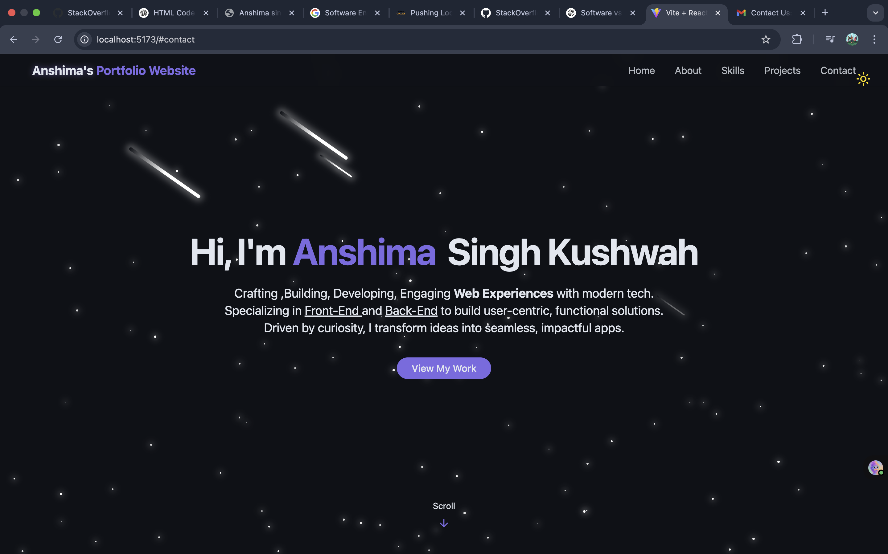
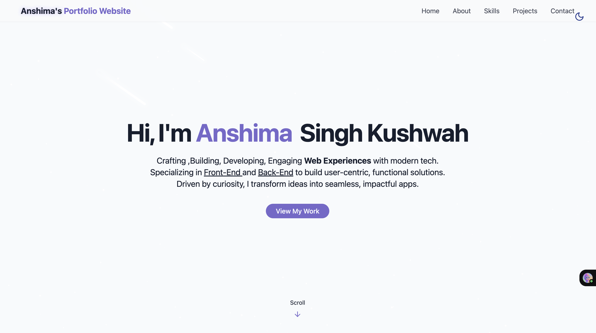
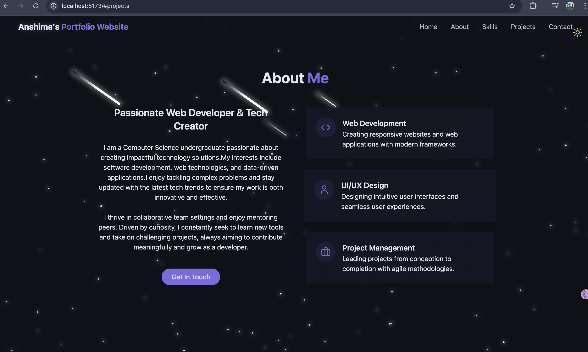
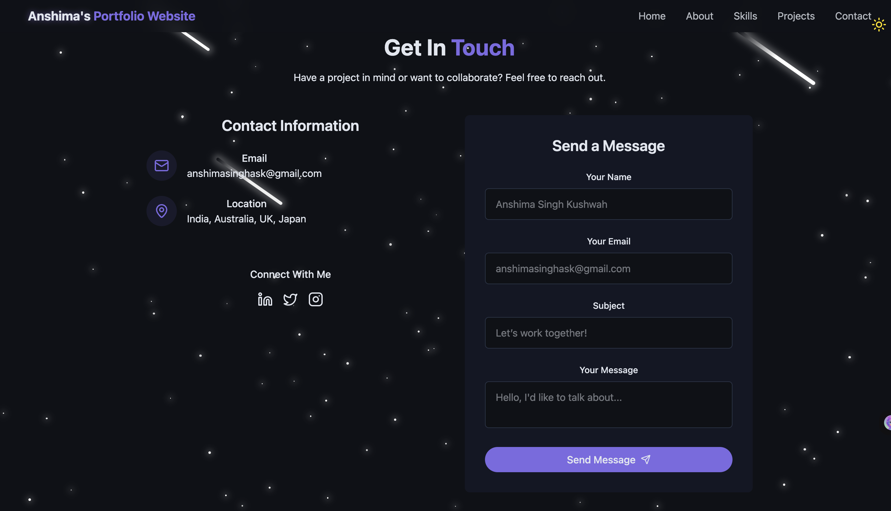

# Modern Portfolio Website with React & TailwindCSS

## [🔗 Live Link](https://my-portfolio-delta-five-52.vercel.app)

using :-

  
  
  
  
  

---

## ⚙️ Tech Stack

- **React** – Component-based UI development
- **Vite** – Lightning-fast build tool
- **TailwindCSS** – Utility-first CSS for styling
- **Lucide Icons** – Clean and beautiful icon pack
- **Radix UI** – Accessible component primitives
- **TypeScript (optional)** – Type safety and tooling
- **GitHub & Vercel** – Deployment

---

## ⚡️ Features

- 🌑 **Light/Dark Mode Toggle**  
  Save theme preference in local storage with beautiful transitions

- 💫 **Animated Backgrounds**  
  Stars, meteors, scroll effects, and glowing UI elements

- 📱 **Responsive Navigation**  
  Desktop and mobile menus with glassmorphism

- 👨‍💻 **Hero & About Sections**  
  Showcase who you are with smooth intro animations and buttons

- 📊 **Skills Grid**  
  Filterable progress bars and categories with animated width

- 🖼️ **Projects Showcase**  
  Display screenshots, tech stacks, and GitHub/demo links

- 📩 **Contact Section**  
  Social icons + responsive contact form with toast notifications

- 🚀 **One-Click Deployment**  
  Easily host your site with Vercel and GitHub

---

### 📸 PROJECT SCREENSHOTS

#### 🖼️ Image 1
`img1.png` – This screenshot displays the herosection of portfolio homepage.  

#### 🖼️ Image 1.2
`img1.2.png` – This screenshot displays the herosection of portfolio homepage in **lighter version**.  

#### 🖼️ Image 2
`img2.png` – This section highlights the featured projects with hover animations.  

#### 🖼️ Image 3
`img3.png` – About me section of the portfolio with a responsive form layout.  

#### 🖼️ Image 4
`img5.png` – Contact section of the portfolio with a responsive form layout.  

---

## 🔗 Useful Links

- [React Documentation](https://reactjs.org/)
- [Tailwind CSS Docs](https://tailwindcss.com/)
- [Lucide Icons](https://lucide.dev/)
- [Radix UI](https://www.radix-ui.com/)
- [Vite](https://vitejs.dev/)
- [Vercel](https://vercel.com/)
